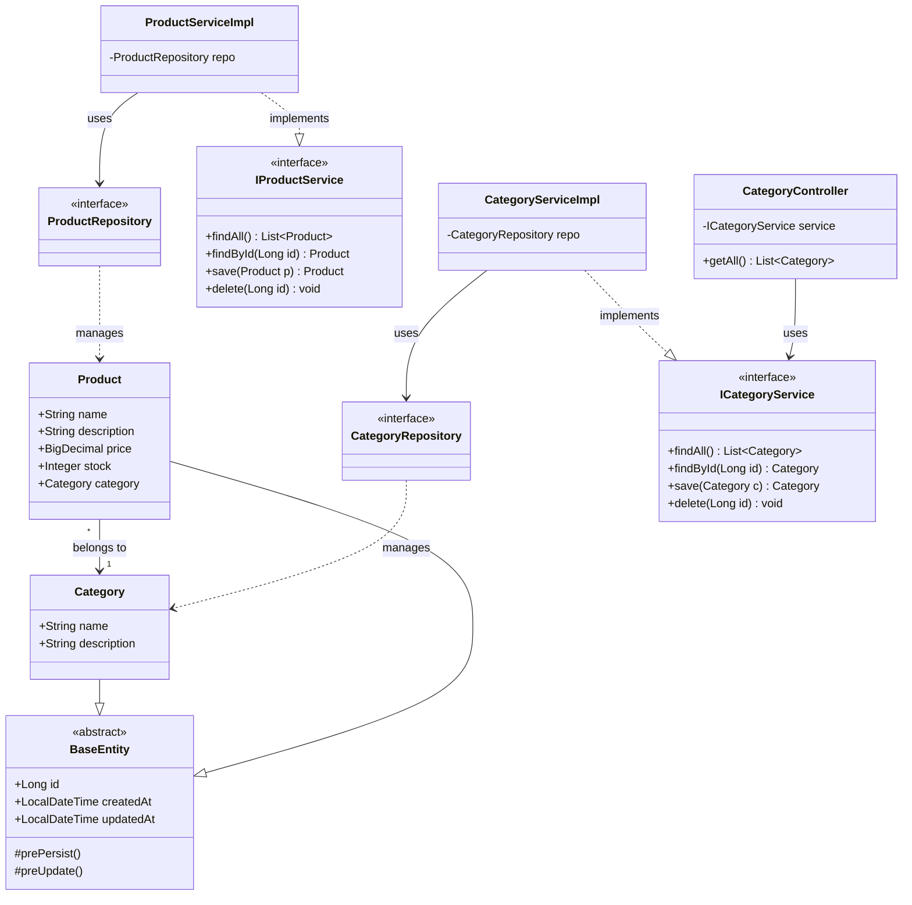

# Arquitectura del Proyecto

Este documento describe la estructura técnica y el flujo de datos del E-commerce.

## Diagrama de Clases (Módulo de Catálogo)

## Flujo de una Petición (Request Flow)

1.  **Client** (Browser/Postman) -> HTTP GET `/api/categories`
2.  **CategoryController** -> recibe la petición y llama al Service.
3.  **CategoryServiceImpl** -> ejecuta lógica y llama al Repository.
4.  **CategoryRepository** -> ejecuta consulta SQL via Hibernate.
5.  **PostgreSQL** -> devuelve los datos.
6.  **Results** -> viajan de vuelta por todas las capas hasta el cliente en formato JSON.
